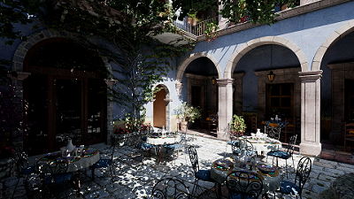
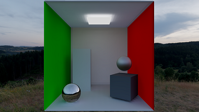

# SteelEngine
Physically-based render engine based on Vulkan API and Nvidia RTX.

## Overview
This is a sandbox for self-education. Two different rendering methods have been implemented: 
* Path Tracing - simple backwards Monte Carlo path tracing
* Hybrid Rendering - classical rasterization with ray queries

Both of them use a physically-based lighting model and there is an ability to switch between them in runtime.

## General Features
* Free camera control
* GLTF scene loading
* HDR environment maps 
* Directional light detection
* Point lights visualization
* Runtime shaders reloading

## Development Environment
### General
* Supported platforms: Windows, Linux
* Prerequisites: git, git lfs, python3, CMake, Vulkan SDK (1.3.243.0)
* Setup project: git lfs install -> git lfs pull -> git submodule init -> git submodule update
### Code formatting
* We use clang-format, see clang-format-all script in repo root. clang-format-17 or higher is required.
### Windows
* MSVC (Visual Studio 2022). Generate Visual Studio solution with CMake
### Linux
* Clang 15 or higher

## Path Tracing

Path tracing is based on the Vulkan ray tracing pipeline, which is provided by `VK_KHR_ray_tracing_pipeline` extension.   
Currently, path tracing doesn't have any runtime denosing, there is just a simple result accumulation when camera the doesn't move.

## Hybrid Rendering

### Drawing phase
Hybrid rendering uses classical g-buffer approach. G-buffer consists of folowing set of textures:
1. `R10G10B10A2unorm` - normals
2. `R11G11B10sfloat` - emission
3. `R8G8B8A8unorm` - albedo + occlusion
4. `R8G8unorm` - roughness + metallic
5. `D32sfloat` - reverse depth

World space positions are restored from the depth, which is reversed to keep a precision in whole range of values.

### Lighting phase
Scene lighting executes in compute shader and in general represents typical PBR. 
Lighting consists of direct light: lighting from directional and point light sources, and indirect light. 
For direct lighting there are simple hard shadows that are calculated using ray queries. 
Indirect lighting aka global illumination uses preconvolved IBL textures and set of captured light probes that form a light volume.

Light volume is generated according to the following steps:
1. Detecting optimal positions for light probes depending on scene geometry
2. Capturing a probe from each position into a cupemap using a path tracing method
3. Converting probe cubemaps into an array of 3rd order spherical harmonics
4. Generating a tetrahedral mesh from probes point cloud

During runtime, the irradiance of the specific point is calculated by detecting the tetrahedron, 
inside which this point is located, and interpolating this tetrahedron's 4 light probes using barycentric coordinates. 
Specular part of indirect lighting is obtained by renormalizing IBL specular value using the light volume's irraidance.

Light volume can be visualized.

## Gallery

### Path Tracing

  

### Hybrid Rendering vs Path Tracing

  

## External Libs
* [glfw](https://github.com/glfw/glfw)
* [glm](https://github.com/g-truc/glm)
* [glslang](https://github.com/KhronosGroup/glslang)
* [imgui](https://github.com/ocornut/imgui)
* [portable-file-dialogs](https://github.com/samhocevar/portable-file-dialogs)
* [stb](https://github.com/nothings/stb)
* [tetgen](https://github.com/ufz/tetgen)
* [tinygltf](https://github.com/syoyo/tinygltf)
* [VukanMemoryAllocator](https://github.com/GPUOpen-LibrariesAndSDKs/VulkanMemoryAllocator)
* [entt](https://github.com/skypjack/entt)
* [easy_profiler](https://github.com/yse/easy_profiler)
* [SPIRV-Reflect](https://github.com/KhronosGroup/SPIRV-Reflect)
* [glaze](https://github.com/stephenberry/glaze)

## Bibliography
* [Ray Tracing Resources Page](http://www.realtimerendering.com/raytracing.html)
* [Depth Precision Visualized](https://developer.nvidia.com/content/depth-precision-visualized)
* [Spherical Harmonics](https://patapom.com/blog/SHPortal/)
* [Light Probe Interpolation Using Tetrahedral](https://www.gdcvault.com/play/1015522/Light-Probe-Interpolation-Using-Tetrahedral)
